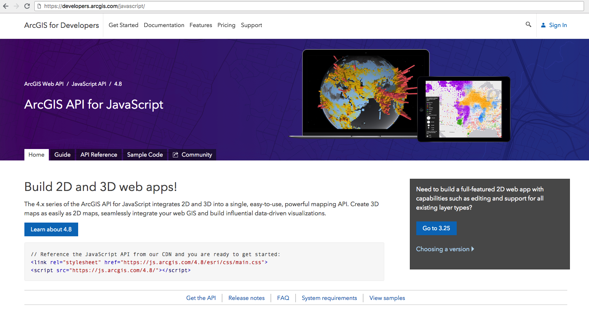
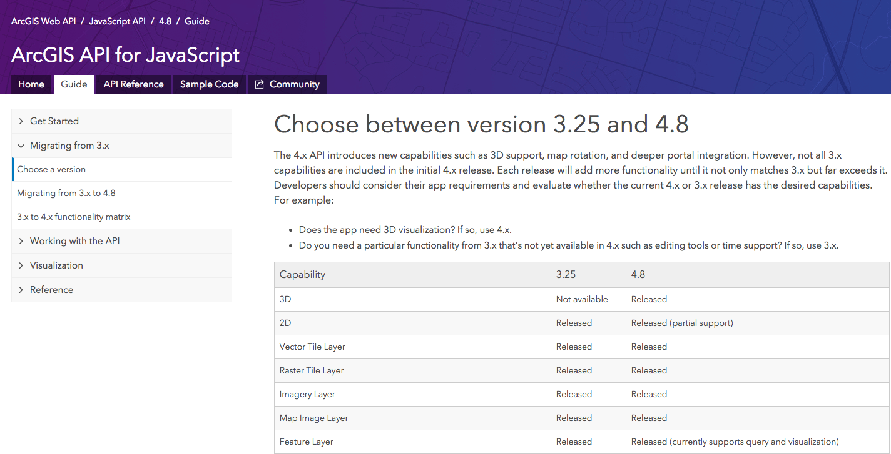
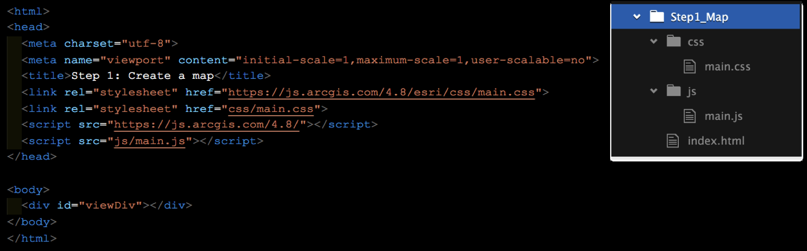
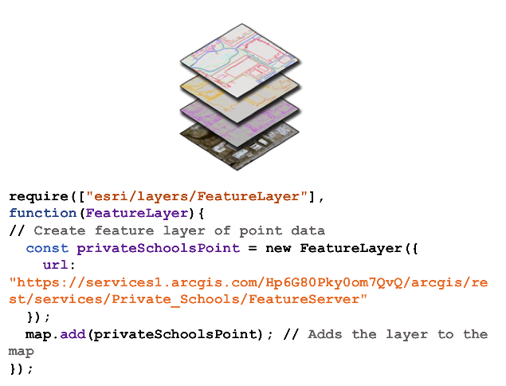
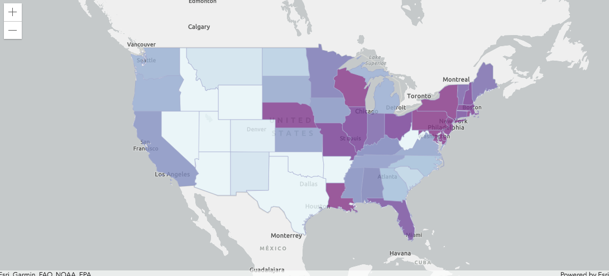
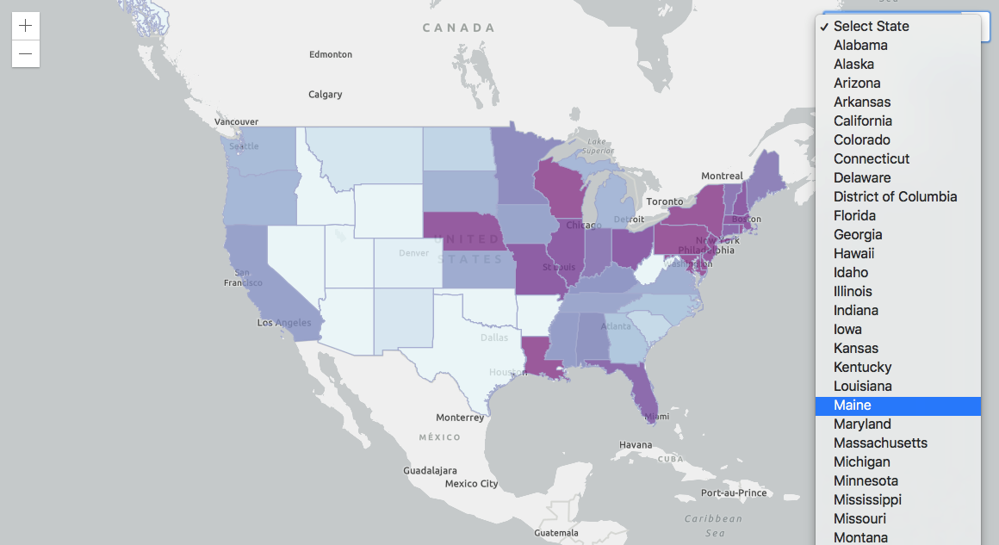
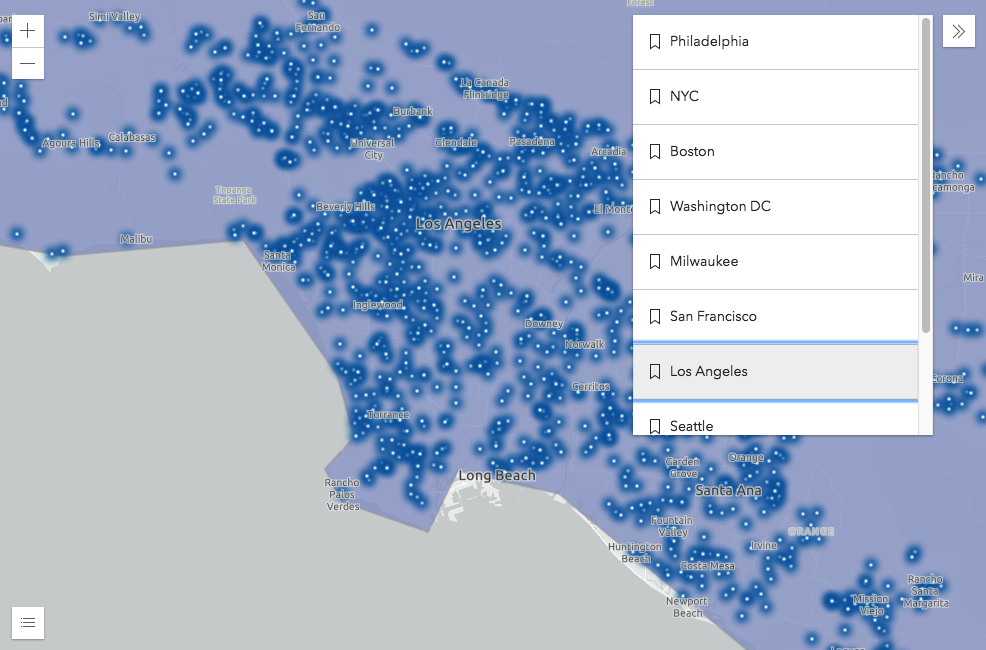
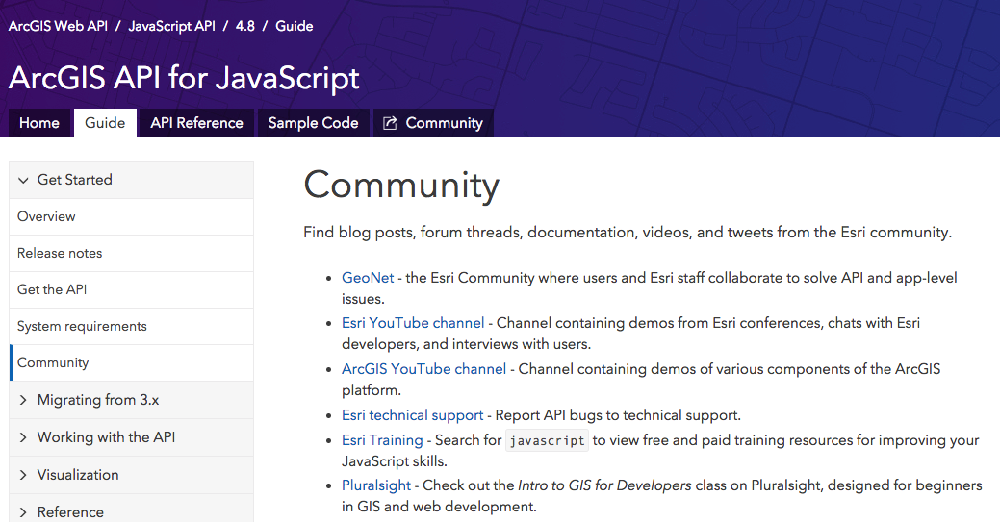

<!-- .slide: data-background="../reveal.js/img/title.png" -->
<!-- .slide: class="title" -->
 
 
 
### ArcGIS API for JavaScript:
### An Introduction
 
Heather Gonzago and Kelly  Hutchins

----

<!-- .slide: data-background="../reveal.js/img/slide3.png" -->
### **Agenda**
 
 - Setup
 - First steps
 - Working with layers
 - Symbols and renderers
 - Make the map interactive
 - Widgets

----

### **Presentations accessible via GitHub**
   
  - This session focuses on version 4.x 
   
  - Concepts remain similar between versions 3.x and 4.x 
   
  - <a href="https://github.com/kellyhutchins/UC-2018-Sessions" target="_blank">https://github.com/kellyhutchins/UC-2018-Sessions</a>

----

### **Where do I begin?**

----

### **Which version of the API is best?**

----

### **Developer Setup**
 

----

### **JSAPI Resources**
 

 - Includes
   - JSHint file
   - TypeScript definition file
   - Build tools, e.g. Bower
   - OAuth popup callback

----

### **Get the API**
 
 - <a href="https://developers.arcgis.com/javascript/latest/guide/get-api/index.html#cdn" target="_blank">CDN</a>
 - Custom builds
 - <a href="https://developers.arcgis.com/downloads/" target="_blank">Download builds</a>
 
 
<pre style="display:inline-block; padding: 5px; margin: 10px auto; width: 100%;"><code data-trim> 
&lt;link rel=&quot;stylesheet&quot; href=&quot;https://js.arcgis.com/4.8/esri/css/main.css&quot;&gt; 
&lt;script src=&quot;https://js.arcgis.com/4.8/&quot;&gt;&lt;/script&gt;
</code></pre>

----

### CSS
 
- <a href="https://developers.arcgis.com/javascript/latest/guide/styling/index.html" target="_blank"><b>Main.css</b></a> contains styles for entire API
   <pre><code data-trim>
   &lt;link rel=&quot;stylesheet&quot; href=&quot;https://js.arcgis.com/4.8/esri/css/main.css&quot;&gt;
   </code></pre>
- <b>View.css</b> is smaller in size but better choice if only needing basic CSS (maps, widgets, etc.)
  <pre><code data-trim>
   &lt;link rel=&quot;stylesheet&quot; href=&quot;https://js.arcgis.com/4.8/esri/css/view.css&quot;&gt;
   </code></pre>
- Themes
    <pre><code data-trim>
   &lt;link rel=&quot;stylesheet&quot; href=&quot;https://js.arcgis.com/4.8/esri/themes/theme-name/main.css&quot;&gt;
   </code></pre>
- Custom CSS (SASS)

----

### **First steps**
 
- How will app be written?
- Separate files or one combined file?
 
 

----

### **Demo: Make a map**
 

----

### **MapView**

Visualize data within Map or Scene
<pre><code data-trim>
const view = new MapView({
  container: "viewDiv",
  map: map,
  zoom: 3,
  center: [-99.14, 36.48]
});
</code></pre>
<pre><code data-trim>
const view = new SceneView({
  container: "viewDiv",
  map: map,
  camera: {
    heading: 210,
    tilt: 78,
    position: {
      x: -8249335,
      y: 4832005,
      z: 50.7,
      spatialReference: {
        wkid: 3857
      }
    }
  }
});
</code></pre>

----

### **Common Gotchas**

- Module order makes a difference 
- Missing module 
- Missing CSS 

----

### **Add layers**
 

 - <a href="https://developers.arcgis.com/javascript/latest/api-reference/index.html#modules-in-esri-layers" target="_blank">Various layer types</a>
1. Load module  
2. Create layers  
3. Set properties  
4. Add to map or scene 
 
 - Basic steps remain the same

----

### **Properties**
- No need for a bunch of get/set statements
<pre style="display:inline-block; padding: 5px; margin: 10px auto; width: 50%;"><code data-trim> 
const map = new Map();
map.basemap = "streets";
map.ground = "world-elevation";
const view = new MapView();
view.center = [-100, 40];
view.zoom = 6;
</code></pre>
- <a href="https://developers.arcgis.com/javascript/latest/guide/working-with-props/index.html" target="_blank">Properties</a> can be set in constructor
<pre style="display:inline-block; padding: 5px; margin: 10px auto; width: 50%;"><code data-trim> 
const map = new Map({
    basemap: "streets",
    ground: "world-elevation"
});
const view = new MapView({
    map: map, 
    center: [-100, 40], 
    zoom: 6
  });
</code></pre>

----

### **Watch for property changes**
 
- <a href="https://developers.arcgis.com/javascript/latest/api-reference/esri-core-Accessor.html#watch" target="_blank">Watch</a> for changes  
<pre style="display:inline-block; padding: 5px; margin: 10px auto; width: 99%;"><code data-trim>
layer.watch("loadStatus", function(status) { // do something});
</code></pre> 
 
- Can also use <a href="https://developers.arcgis.com/javascript/beta/api-reference/esri-core-watchUtils.html" target="_blank">esri/core/watchUtils</a> utility methods 
 
- See this in action with the <a href="https://developers.arcgis.com/javascript/latest/sample-code/watch-for-changes/index.html" target="_blank">Watch for Changes</a> sample

----

### **Demo: Add layer to sample app**
 

----

### **Renderers**
 
- <a href="https://developers.arcgis.com/javascript/latest/sample-code/get-started-visualization/index.html" target="_blank">Define</a> a set of symbols to use for the layer 
 
- Sets the rules on how the symbols are used 
 
- Basic coding pattern
<pre style="display:inline-block; padding: 5px; margin: 10px auto; width: 99%;"><code data-trim>
const layerRenderer = new UniqueValueRenderer(); // Set the renderer
const featurelayer = new FeatureLayer({
    url: "featurelayer url",
    renderer: layerRenderer // Pass in renderer to featurelayer using default properties
})
</code></pre>

----

### **Symbols**
 
- Renderers use symbology, e.g. points, lines, polygons 
 
- Set the renderer's symbol
<pre style="display:inline-block; padding: 5px; margin: 10px auto; width: 75%;"><code data-trim>
const symbol = new SimpleMarkerSymbol({
    // Set the properties
});
</code></pre>
<pre style="display:inline-block; padding: 5px; margin: 10px auto; width: 75%;"><code data-trim>
const renderer = new UniqueValueRenderer({
    defaultSymbol: symbol, // Set symbol for renderer
    // Provide additional properties if necessary
});
</code></pre>

----

### **Autocasting**
 
- No need to <b>Require()</b> the module 
 
- Look for the  label in SDK's API Reference 
 
- <a href="https://developers.arcgis.com/javascript/latest/sample-code/sandbox/index.html?sample=layers-portal" target="_blank">Create a layer from portal item sample </a> shows autocasting in action 
 
- Read more about <a href="https://developers.arcgis.com/javascript/latest/guide/autocasting/index.html" target="_blank">Autocasting</a> in the Guide 

----

### **Demo: Update a feature layer's renderer**
 

----

### **Map interaction using popups**
 

- Responds to mouse clicks
  
- Provides info on:
  - feature attributes
  - location
  - search results
  
- Customizable

----

### **PopupTemplate**
- View has associated popup, can set content here
- FeatureLayer has associated <a href="https://developers.arcgis.com/javascript/latest/api-reference/esri-PopupTemplate.html" target="_blank">popupTemplate</a> property
- Position the popup using *dockOptions*
<pre style="display:inline-block; padding: 5px; margin: 10px auto; width: 75%;"><code data-trim>
const popupTemplate = new PopupTemplate({
    title: "Title of the popup",
    content: [{
      // Set the content here
    }]
});
</code></pre>
<pre style="display:inline-block; padding: 5px; margin: 10px auto; width: 75%;"><code data-trim>
const featurelayer = new FeatureLayer({
    url: "url to the feature layer",
    outFields: ["*"],
    popupTemplate: popupTemplate,
    renderer: renderer
});
</code></pre>

----

### **Demo: Add a popup to the map**
 

----

### **Querying features**

- FeatureLayerView
  - Query and highlight graphics in the view
  - Use with large datasets
- FeatureLayer <a href="https://developers.arcgis.com/javascript/latest/api-reference/esri-layers-FeatureLayer.html#querying" target="_blank">queries</a>
 
 

<pre style="display:inline-block; padding: 5px; margin: 10px auto; width: 75%;"><code data-trim>
layerView.queryFeatures(query).then(function(results) {
  results.features.forEach(function(feature) {
    const featureId = feature.attributes.FID;
    ...
</code></pre>
<pre style="display:inline-block; padding: 5px; margin: 10px auto; width: 75%;"><code data-trim>
const select = document.getElementById("selectState");
select.addEventListener("change", function(e) {
  const featureId = select.value;
  highlight = layerView.highlight(parseInt(featureId));
  ...
</code></pre>

----

### **Demo: Query features within a layer**

----

### **Using web maps**
 
- Reduces coding effort 
 
- Retains all customizations with rendering, popups, etc. 
<pre style="display:inline-block; padding: 5px; margin: 10px auto; width: 99%;"><code data-trim>
const map = new WebMap({
    portalItem: {
      id: "209aa768f537468cb5f76f35baa7e013" // Remember, portalItem is autocasted
    }
});
</code></pre>

----

### **Demo: Add a web map to an application**
 

----

### **Widgets**
 
- <a href="https://developers.arcgis.com/javascript/latest/api-reference/index.html#modules-in-esri-widgets" target="_blank">Encapsulates functionality</a>
- Similar coding pattern across all widgets
<pre style="display:inline-block; padding: 5px; margin: 10px auto; width: 99%;"><code data-trim>
view.when(function){
    var featurelayer = map.layers.getItemAt(0);
    // Create widget and set its properties
    const legend = new Expand({ 
      content: new Legend({
        view: view,
        style: "card"
      }),
      view: view, // Expand view
      group: "top-right"
    });
  });
</code></pre>

----

### ** View UI**

- Position widgets
  - Add
  - Move
  - Remove
   

<pre style="padding: 5px; margin: 10px auto; width: 50%;"><code data-trim>
view.ui.add([legend, bookmarks], "top-right");
</code></pre>

----

### **Demo: Add widgets to the application**
 

----

### **Where can I get more info?**

- SDK Documentation
- Esri-related training and webinars
- JavaScript online training, free and not-so-free
- User forums, e.g. GeoNet, StackExchange, Spatial Community in Slack, etc. 
 
<a href="https://developers.arcgis.com/javascript/latest/guide/community/index.html" target="_blank">

----

### **See us here**

| Workshop  |  Location |  Time Frame |
|---|---|---|
| Intro repeat | SDCC 30E |Tuesday 7/10, 4PM |     
| ArcGIS API for JavaScript: What's New | SDCC 31B  | Tuesday 7/10, 10AM |     
| Building 3D Apps with ArcGIS API for JavaScript  | SDCC 08  | Tuesday 7/10, 2:30PM  |      
| ArcGIS API for JavaScript: The Road Ahead | SDCC 07 A/B | Wednesday 7/11, 8:30AM |
| ArcGIS API for JavaScript: Best Practices for Building Apps | SDCC 31A | Wednesday 7/11, 2:30PM | 
| Debugging ArcGIS API for JavaScript Applications | Demo Theater 06 | Wednesday 7/11, 2:30PM |

----

### **See us here (continued)**

| Workshop  |  Location |  Time Frame |
|---|---|---|
| Developing Your Own Widget | SDCC 04 | Thursday 7/12. 8:30AM |
| 2D Visualization | SDCC 33C | Thursday 7/12, 8:30AM |
| Building Mobile Apps | SDCC 16A | Thursday 7/12, 8:30AM |
| 3D Visualization | SDCC 33C | Thursday 7/12, 10AM |
| Working with Feature Layers, Dynamic Map Services, and OGC in the API| SDCC Ballroom 06D | Thursday 7/12, 10AM |

----

### **Questions???**

----

<!-- .slide: data-background="../reveal.js/img/survey.png" -->

